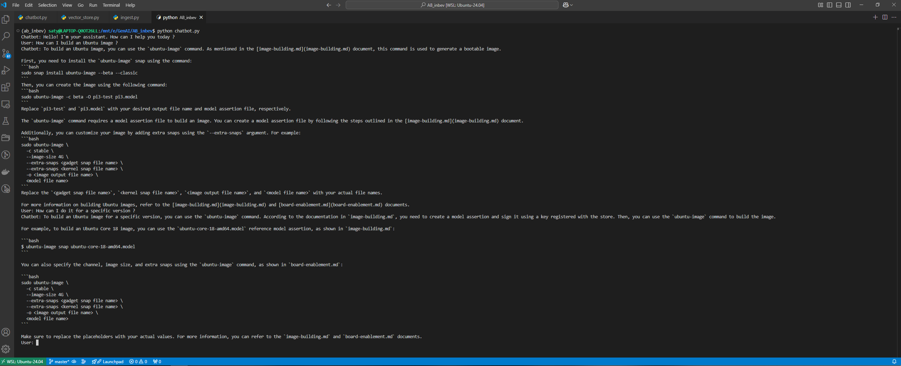
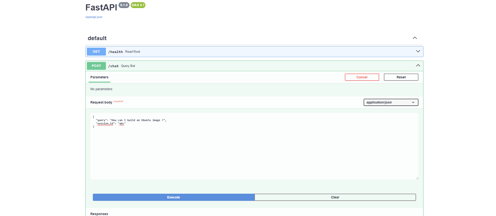
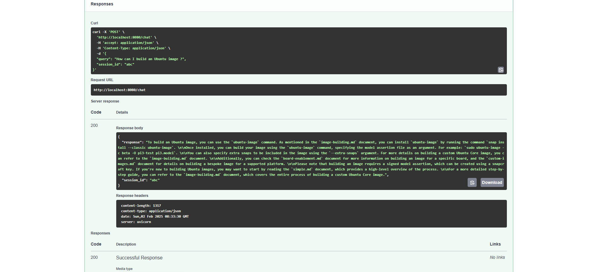
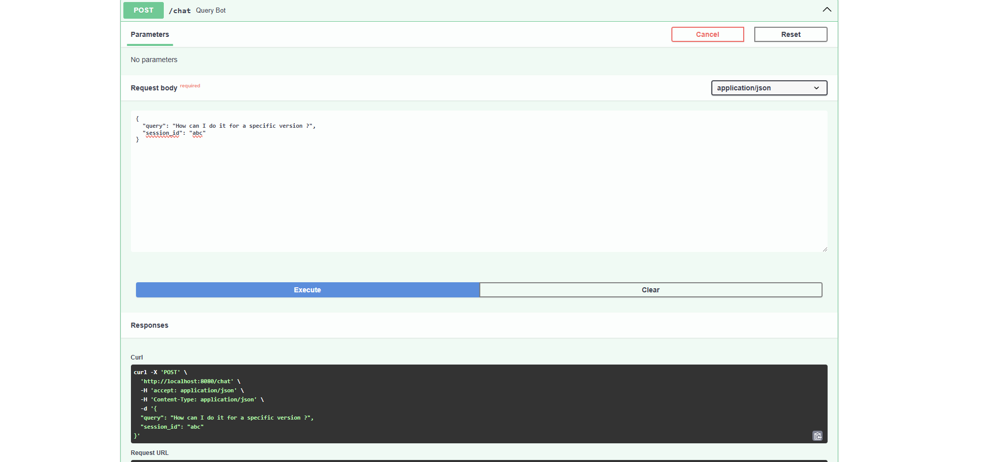
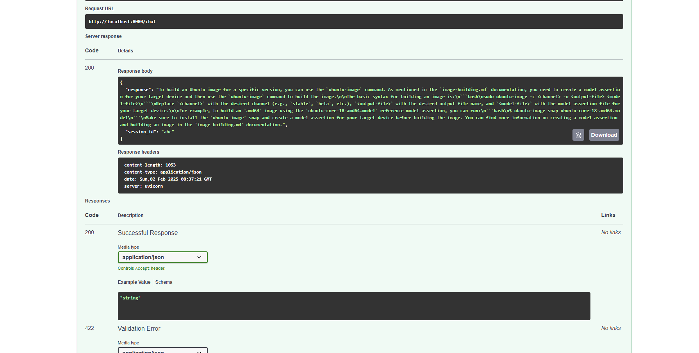

# README

## Project Overview
This project consists of a RAG based chatbot implementation that utilizes a FAISS vector database for efficient retrieval. 

The system is composed of two main scripts: 
`ingest.py` for data ingestion, and 
`chatbot.py` for interacting with the chatbot.

## Setup and Installation
Ensure you have Python installed and required dependencies available. The dependencies can be installed using:
```sh
pip install -r requirements.txt
```

## Data Ingestion
The `ingest.py` script is responsible for ingesting data into the FAISS vector database.

### **Usage**
Run the following command to ingest data:
```sh
python ingest.py -d "<path-to-data-directory>" -e "<file extension to ingest>"
```
- `<path-to-data-directory>`: Directory containing data files to ingest.
- `<file extension to ingest>`: Specify file types (e.g., `.txt`, `.csv`).

## Running the Chatbot
The chatbot logic is implemented in `chatbot.py`. It can be executed directly from the terminal.

### **Usage**
```sh
python chatbot.py
```

## Chatbot Demo
A working demo image of the chatbot is available under the `Assets` folder.



## Expose the chatbot as FastAPI application 

Query the `/chat` enpoint to interact with the chatbot.

Queries having same session id are considered to be the part of same chat context.

Run the application by 
```sh
python app.py"
```

## Swagger API testing










